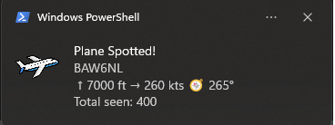
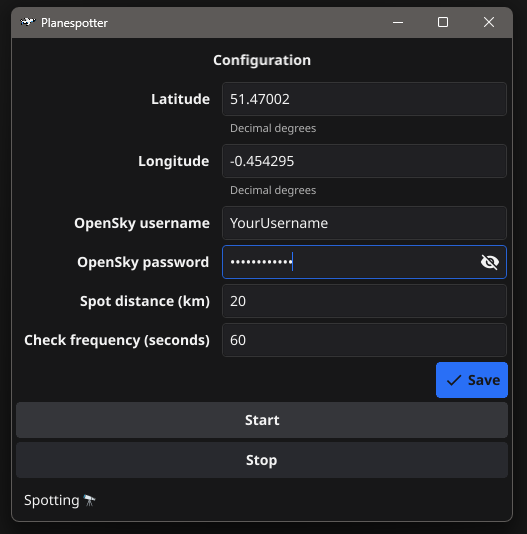

# planespotter v0.1

## Description

One of many 'planespotter' apps, which tells you when a new plane enters the area around a given location according to ADS-B data and pops up a notification. Also keeps a running total of how many planes you have ever spotted, and their callsigns.

I used this as practice for consuming different API structures, and it tied in nicely with my love of aviation :)

Uses [The OpenSky Network](https://opensky-network.org)

Written in Go using [Fyne](https://fyne.io/), [Beeep](https://github.com/gen2brain/beeep) for notifications and [godotenv](https://github.com/joho/godotenv) for configuration from env vars.

Lots of things that need tidying up a bit from this initial version, and improvements (see below)

## Configure and run

1. Create an OpenSky account at [The OpenSky Network](https://opensky-network.org/)'s site
2. Run the app
3. Fill in your OpenSky username/password, and change your longitude and latitude if required
4. Click on Start - the status at the bottom should change to 'Spotting'

## Potential future improvements

* Some code can still be streamlined, although it has been improved slightly. We convert between types a lot to save and retrieve data. I suspect more could be handled in memory rather than with file read/writes.
* Test coverage is okay but could be improved especially around error conditions.
* Error messaging is inconsistent in places.
* Ability to enter a placename and use a Geocoding API to find the latitude/longitude for you rather than expecting you to enter raw numbers.

1. Notifications should start appearing if any planes are nearby!

## Attributions

* All data is from [The OpenSky Network](https://opensky-network.org)
* Notifications use [Beeep](https://github.com/gen2brain/beeep)
* Configuration uses [godotenv](https://github.com/joho/godotenv)
* Icon uses [Airplane icons created by Mihimihi - Flaticon](https://www.flaticon.com/free-icons/airplane)
* UI using [Fyne](https://fyne.io)
